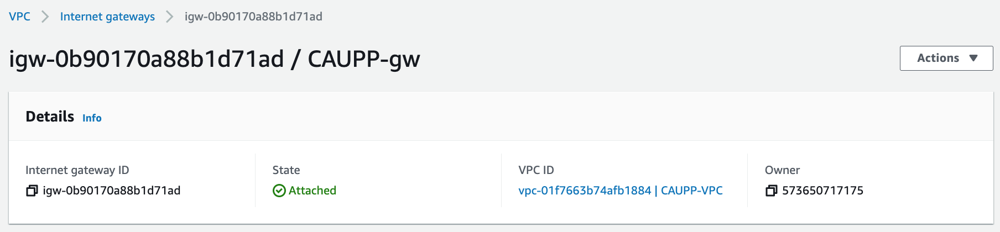
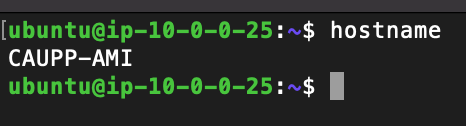

# Part One: Building a VPC

## VPC

This VPC was made with a private IP range of 10.0.0.0/24 this means that IPs in the range 10.0.0.0 to 10.0.0.255 are available for use. 

## Subnet

This subnet has range 10.0.0.0/28 (10.0.0.0 - 10.0.0.15)

## Internet Gateway

The internet gateway was connected and attached to the VPC from above.

## Route Table 

The route table is associated with the VPC and points traffic to the internet gateway from above.

## Security Group

The rules on this security group allow SSH access from Wright State Campus and my home IP address

# Part Two: Creating an EC2 instance

First, I created the instance and assigned an ubuntu AMI to it. This AMI has a default username of ubuntu. The next step was to attach it to the VPC I created in part one via a drop down menu in the Network Settings section.

I chose not to auto-assign a Public IPv4 address and opted to assign an Elastic IP to it later in the process. The default volume the instance starts with is 8 GiB. I did not have to do anything to assign this value.

The last two steps before launching the instance is to give it a "Name" tag (I choose the name "CAUPP-instance") and to associate it with the security group from part one by choosing "Select existing security group" and choosing CAUPP-sg from a drop down menu.

Once the instance has launched, create an elastic IP by navigating the tabs on the left. Click Allocate Elastic IP and be sure to give it the proper name tag. Once created use the "Actions" button to select "Associate Elastic IP adress" with your freshly created instance.

ssh in with your key, the AMI's default username, and the elastic IP
You can change the hostname with `sudo hostnamectl set-hostname NEW_HOSTNAME`

When finished, your instance details should look like this:

And your ssh connection should look like this.
