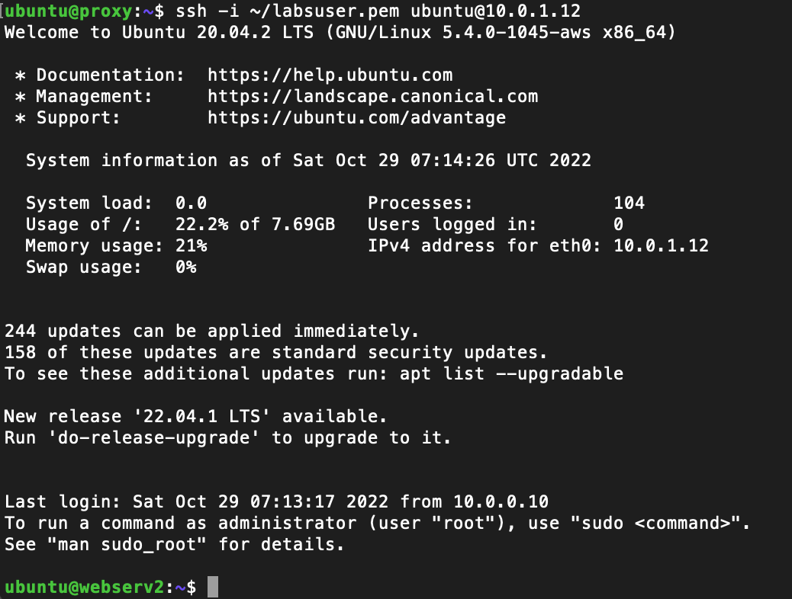

## Load Balancing Setup

* Created an `/.ssh/config` file and included the private IP's of the two web server instances

* to ssh into the proxy server from my computer, I need to use my private key. And I will need this same key to get into the other instances. I copied the file from my local file system to the proxy instance and made sure to `chmod 400 keyname` to set the right permissions
 
 