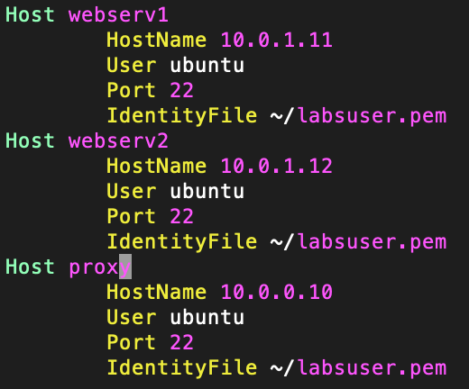

## Load Balancing Setup

* Created an `/.ssh/config` file and included the private IP's of the two web server instances

* to ssh into the proxy server from my computer, I need to use my private key. And I will need this same key to get into the other instances. I copied the file from my local file system to the proxy instance and made sure to `chmod 400 keyname` to set the right permissions
 
![ssh connections screenshot](./screenshots/ssh2.

## Setting up HAProxy
Reference: https://linuxhostsupport.com/blog/how-to-install-and-configure-haproxy-on-ubuntu-20-04/

* copy the default config file with `sudo cp -a /etc/haproxy/haproxy.cfg{,.orig}`
* I added these settings to my new config file
    * `frontend haproxy-main`
    * `bind *:80`
    * `option forwardfor`
    * `default_backend apache_webservers`    

    * `backend apache_webservers`
    * `balance roundrobin`
    * `server webserv1	10.0.1.11:80 check`
    * `server webserv2	10.0.1.12:80 check`

* Restart the system `sudo systemctl restart haproxy`

## Setting up Apache2
Reference: https://ubuntu.com/tutorials/install-and-configure-apache#1-overview

* ssh into your webserver instance
* cd into `/var/www/html` and replace the index file with your content
* cd into `/etc/apache2/sites-available/`
* create a config file by copying the defaults `sudo cp 000-default.conf html.conf`
* edit your new config file
    edit documentroot
    add servername
* activate config file `sudo a2ensite html.conf`
* `sudo systemctl reload apache2`